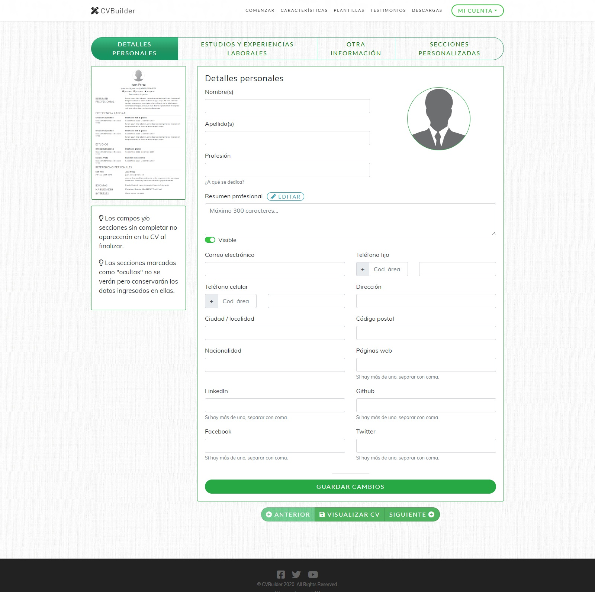

# CVBuilder UI
Asistente detallado para la creación de curriculum en línea de forma rápida y eficaz.

Interfaz de usuario basada en ReactJs.

## Funcionalidades

* Creación de usuarios
* Completar secciones del curriculum de forma modular
* Posibilidad de crear secciones personalizadas
* Tres plantillas seleccionables de curriculum
* Generación de PDF
* Imprimir curriculum

## Tecnologías/librerías/plugins

* HTML5
* CSS
* Bootstrap
* Javascript
* Ajax
* ReactJs
* Font Awesome
* dom-to-image
* jsPDF
* Formik
* Yup

-------------

Para el backend -> https://github.com/gustavo-vasquez/cvbuilder-project-api

* ASP.NET Core Web API
* Entity Framework Core / Migrations
* JwtBearer Authentication
* SQL Server
* Automapper

-------------

PORTADA
:-------------------------:

LOGIN Y REGISTRO
:-------------------------:

PESTAÑAS CON LAS SECCIONES DEL CURRICULUM
:-------------------------:

CAMBIO DE PLANTILLA
:-------------------------:

IMPRIME O DESCARGA COMO PDF
:-------------------------:

| ** PLANTILLAS DISPONIBLES ** |
:---------------------------------:

| Classic   |      Elegant      | Modern |
|----------|:-------------:|-------|
|  |   |  |

## Notas
El proyecto se creó utilizando [create-react-app](https://create-react-app.dev/docs/getting-started "Enlace a documentación")

## Autor
Gustavo Vasquez
